A real-time chat app built with the MERN stack and Socket.IO. Send messages and photos instantly, see who's online, and stay signed in securely.


## Preview



## Features

- Real-time messaging with Socket.IO
- Online/offline status for every user
- Image messages and profile pictures (Cloudinary)
- Messages appear instantly and roll back if sending fails
- JWT authentication with httpOnly cookies and bcrypt-hashed passwords
- Rate limiting and bot protection with Arcjet
- Welcome email on sign-up (Resend)
- Optional keyboard and notification sounds
- Chats and Contacts tabs, plus `Esc` to close a conversation

## How It Works



Messages are saved through the REST API, then pushed to the receiver over Socket.IO.

## Tech Stack

- **Frontend:** React 19, Vite, Tailwind CSS, daisyUI, Zustand, React Router, Axios, Socket.IO client
- **Backend:** Node.js, Express 5, Socket.IO, MongoDB (Mongoose), JSON Web Tokens, bcryptjs
- **Services:** Cloudinary, Resend, Arcjet


## Getting Started

### Prerequisites

- Node.js 20 or newer
- A MongoDB database
- Cloudinary, Resend and Arcjet accounts

### 1. Clone and install

```bash
git clone https://github.com/AnikAbdullah/Whisper.git
cd Whisper
npm install --prefix backend
npm install --prefix frontend
```

### 2. Add environment variables

Create a `.env` file in the `backend` folder:

```env
PORT=3000
NODE_ENV=development
CLIENT_URL=http://localhost:5173

MONGO_URI=your_mongodb_connection_string
JWT_SECRET=your_jwt_secret

RESEND_API_KEY=your_resend_api_key
EMAIL_FROM=your_sender_email
EMAIL_FROM_NAME=Whisper

CLOUDINARY_CLOUD_NAME=your_cloud_name
CLOUDINARY_API_KEY=your_cloudinary_api_key
CLOUDINARY_API_SECRET=your_cloudinary_api_secret

ARCJET_API_KEY=your_arcjet_key
ARCJET_ENV=development
```

### 3. Run the app

Start the backend on http://localhost:3000:

```bash
cd backend
npm run dev
```

In a second terminal, start the frontend on http://localhost:5173:

```bash
cd frontend
npm run dev
```

### Production build

From the project root:

```bash
npm run build
npm start
```

With `NODE_ENV=production`, the backend also serves the built frontend.

## API Endpoints

| Method | Endpoint | Description |
| --- | --- | --- |
| POST | `/api/auth/signup` | Create an account |
| POST | `/api/auth/login` | Log in |
| POST | `/api/auth/logout` | Log out |
| GET | `/api/auth/check` | Get the logged-in user |
| POST | `/api/auth/update-profile` | Update the profile picture |
| GET | `/api/messages/contacts` | List all other users |
| GET | `/api/messages/chats` | List users you've chatted with |
| GET | `/api/messages/:id` | Get the conversation with a user |
| POST | `/api/messages/send/:id` | Send a message |

Real-time events: `getOnlineUsers` sends the list of online users, and `newMessage` delivers incoming messages.

## Project Structure

```text
Whisper/
├── backend/      # Express API, Socket.IO server, MongoDB models
│   └── src/
└── frontend/     # React + Vite client
    ├── public/   # static assets, including the README animations
    └── src/
```

## Author

**Abdullah Al Taieb** ([@AnikAbdullah](https://github.com/AnikAbdullah))


